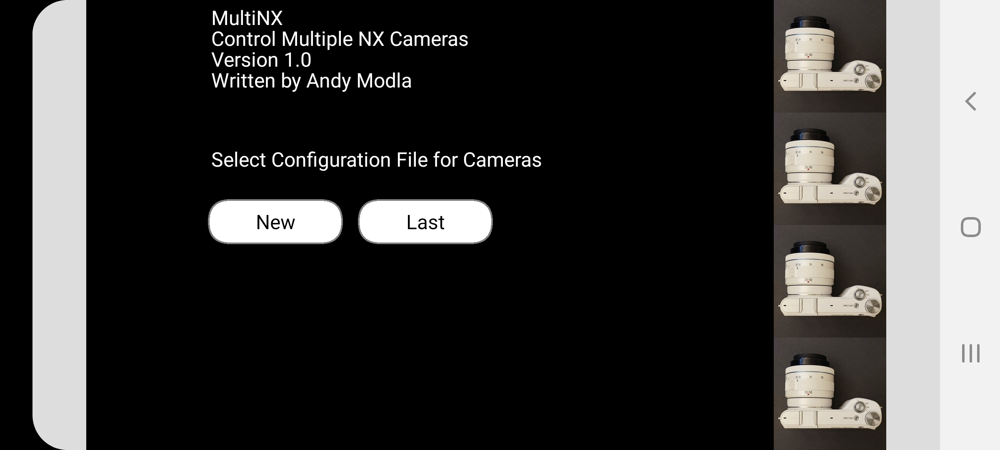

# MultiNX Camera Control

 __On a local WiFi network, remotely synchronize and control multiple Samsung NX2000, NX300, and NX500 cameras and Android phone cameras running the Open Camera Remote app__
 
 

 MultiNX is a cross platform application for synchronizing and controlling one or more Samsung NX2000, NX300, and NX500 cameras. The application can also control Android phone cameras running the [Open Camera Remote app](https://play.google.com/store/apps/details?id=net.sourceforge.opencameraremote). Possible uses for the MultiNX application are photo and video capture sessions where one or more cameras are not easily accessible or wire focus/shutter control is not possible. I have used MultiNX with twin NX2000, NX300, and NX500 cameras in a stereo camera rig to set camera parameters, while using USB wired focus/shutter control to take photos. 
 
The NX cameras use the open-source Linux based (Tizen) operating system and Samsung provided a way to access it on power-up for diagnostics and testing. This project does not apply to the NX1000 or NX1100 cameras because those cameras use a different underlying operating system VxWorks, not Linux (Tizen).
 
 MultiNX uses Telnet and HTTP protocol commands to communicate with the connected NX cameras. MultiNX runs on Android and Windows PC platforms.

 MultiNX supports up to four multiple camera connections at once. The WiFi connection in each NX2000 and NX300 camera is made with the E-Mail WiFi setup service on the camera, however it does not use the email service. With the NX500, the Menu system turns on WiFi access. It has not been tested with more than four camera connections.
 
 Note: The NX300 and NX500 implementations are not yet complete because not all hardware keys can be controlled remotely. 

 The MultiNX application is written in [Processing](https://processing.org/) and Java, and runs on a PC or Android device (phone, tablet, and Chromebook). The application may also run in the IOS Processing SDK, but I have not tested. 
 
 The application connects to each Samsung NX camera over WiFi on a local network. The WiFi network does not have to be connected to the Internet and normally should not be connected to the Internet due to security issues with telnet. For my use, I establish a local network with a USB battery powered mobile router like the TP-Link_290A and other AC powered routers. I have used my Telecom service provider modem router and Android mobile phone hot-spot connection feature. These are connected to the Internet for a short period of time during my tests.
 
 The application only invokes telnet and HTTP protocols to communicate with the cameras. The application does not modify the internal Tizen file system to add shell or application code. The application sends commands to the camera provided by telnet. A start up "autoexec.sh" shell script in the root folder of the SD memory card starts the telnet and HTTP services in the camera. The shell script also starts an optional FTP server for photo transfer after a shoot is finished. The application is not an FTP client. I use [Filezilla](https://filezilla-project.org/) on a PC to transfer photos from all the connected cameras. The FTP server on each camera can be commented out to improve performance. 
 
 With the NX500 camera, Tizen lacks code for Telnet, HTTP and FTP servers execution, so these services were copied from the NX300 and placed on the SD card to start on power up. The NX500 also enters a diagnostic factory mode that disallows touch screen focus unless it is circumvented by installing code in the NX500 file system as described by [ottokiksmaler/nx500_nx1_modding - Running_scripts_without_factory_mode_BT.md](https://github.com/ottokiksmaler/nx500_nx1_modding/blob/master/Running_scripts_without_factory_mode_BT.md) I have not tried this approach yet.
 
 The application synchronizes each camera's exposure settings, does simultaneous focus, and synchronized shutter release at nearly the same time. It does not provide Live-View with the cameras. The application features are limited by what can be done with telnet commands to control the camera and read its status.

 The NX cameras do not show their local network IP address. Only the camera's MAC address is available in the Menu - Settings - Device Information. The MAC address helps to find the camera's IP address with an app like "Network Scanner" in the Google play store. [https://play.google.com/store/apps/details?id=com.myprog.netscan&hl=en_US&gl=US](https://play.google.com/store/apps/details?id=com.myprog.netscan&hl=en_US&gl=US) The IP address is needed to configure the software for the cameras to be connected. A text file informs the application what cameras to connect, camera name, and other (unimplemented) options.
 
 Using telnet commands incorrectly can lock up the camera, so there is some risk using this application. After removing and reinserting the battery, a power-on restores the camera functions. The author is not responsible for uses of this software and its effect on your camera. __USE AT YOUR OWN RISK__.
 
 This MultiNX application code is a work in progress. There are many improvements possible.
 

## Notice

 THIS SOFTWARE IS PROVIDED BY THE COPYRIGHT HOLDERS AND CONTRIBUTORS "AS IS" AND ANY EXPRESS OR IMPLIED WARRANTIES, INCLUDING, BUT NOT LIMITED TO, THE IMPLIED WARRANTIES OF MERCHANTABILITY AND FITNESS FOR A PARTICULAR PURPOSE ARE DISCLAIMED. IN NO EVENT SHALL THE COPYRIGHT HOLDER OR CONTRIBUTORS BE LIABLE FOR ANY DIRECT, INDIRECT, INCIDENTAL, SPECIAL, EXEMPLARY, OR CONSEQUENTIAL DAMAGES (INCLUDING, BUT NOT LIMITED TO, PROCUREMENT OF SUBSTITUTE GOODS OR SERVICES; LOSS OF USE, DATA, OR PROFITS; OR BUSINESS INTERRUPTION) HOWEVER CAUSED AND ON ANY THEORY OF LIABILITY, WHETHER IN CONTRACT, STRICT LIABILITY, OR TORT (INCLUDING NEGLIGENCE OR OTHERWISE) ARISING IN ANY WAY OUT OF THE USE OF THIS SOFTWARE, EVEN IF ADVISED OF THE POSSIBILITY OF SUCH DAMAGE.
 

## How to setup and configure the cameras and application

Copy the contents of the sdcard-NXnnnn folder to the base folder of the SD card. Here are instructions for the NX2000 as a setup guide example.

1. For each NX2000 camera copy the autoexec.sh and inetd.conf files from the sdcard-NX2000 folder in this repository to the base folder of the camera memory card. Important - do this after Formatting your memory card. For the NX300 and NX500 camera copy the contents of the folder sdcard-NX300 or sdcard-NX500, respectively to the base folder of the camera memory card.

2. On each NX2000 camera perform the following HOME setup:
	
	> Expert - Manual 
	
3. On each NX2000 camera perform the following MENU setup:
	
	> AutoShare off
	> 
	> Photo Size 2M recommended for quick downloads, otherwise 20M when not saving RAW
	>
	> RAW + Normal (note RAW saves at highest photo size 20M)
	> 
	> Auto focus - Single Auto Focus
	> 
	> Touch Focus  - ON
	>
	> ISO Customizing - ISO Step  1 Step, Auto ISO Range - ISO 3200
	> 
	> Map Direct Link button to E-Mail: Menu - Key Mapping - DIRECT LINK -> Email
	
4. Use Direct Link button to connect to a WiFi router for E-Mail. You will enter a password to access your router. You don't have to be connected to the Internet. Return to camera shoot live view mode. Each time you power on the camera, you will press the Direct link button to automatically sign into your WiFi router. Press OK prompt, and touch back button on the screen to complete the connection. Do not press the cancel button.
	
5. From MENU - Settings - Device Information, get the MAC identification address and label each camera with its MAC address.
	
6. Use an Android app such as "Network Scanner" on your local WiFi network to scan for Samsung cameras and write down the IP address associated with each MAC address you found in step 5.
	
7. Create a text file in a folder for the application to find. The text file contains one line for each camera as follows: IP Address, space, camera name, space, camera type NX2000, space, and camera orientation in degrees 0 (unimplemented feature). The camera name appends to photo file name as a suffix _name.

	Here is an twin camera configuration for 3D photography. File named: twincameras_tplink_101_102.txt
	
	```
	192.168.0.101 L NX2000 0 
	192.168.0.102 R NX2000 0 
	```
	
	Here is a four camera configuration connected using a phone WiFi hotstop. File named: cameraphotonet_LL_LM_RM_RR.txt
	
	```
	192.168.216.96 LL NX2000 0
	192.168.216.18 LM NX2000 0
	192.168.216.56 RM NX2000 0
	192.168.216.54 RR NX2000 0
	```
	
8. Start the application and select a new configuration. Find the folder with the configuration text file and select it.
	The app will attempt to connect to each camera in the configuration list with telnet.

## Building MultiNX for Android

When you build MultiNX for Windows or Android you must add the SelectFile and oscP5 library to the Processing SDK. See [Processing Library](https://processing.org/reference/libraries/) information under Contributions.

[SelectFile Library Documentation](https://andrusiv.com/android-select-file/)

[oscP5](http://www.sojamo.de/libraries/oscp5/)

The SelectFile library only supports internal memory file access on Android devices.

Comment out Windows code and uncomment Android code, or vice-versa in the file "Platform.pde".

## Using MultiNX app

 
 
 
 
 
 
 
 
 
 


The right hand column of soft keys correspond to physical button keys on the NX2000.

1. Focus - Press and hold focus in the connected cameras. Updates the display with camera shutter, FN, and ISO for main camera.
2. Shutter - Press the shutter in the connected cameras and release focus.
3. Left - rotate wheel counter clockwise.
4. Right - rotate wheel clockwise.
5. EV - press the EV button
6. Record - start and stop video recordings.
7. Home - display the Home menu
8. PB -  Playback the photos or video

The bottom row of soft keys provide features for accessing menu keys, and viewing screenshots and photos. It also includes functions for buttons the NX2000 does not have but whose function can be invoked.

1. Screen - displays a screenshot of the main camera (first camera in the configuration list file)
2. Show - display the last photo taken on the connected cameras (up to four images)
3. Save - save the current displayed photos in a folder. The first invocation selects the folder for saving. The MultiNX application only saves JPG photo types in local Windows PC or Android device internal storage folders. To retrieve RAW images directly from the camera, use a FTP client, like FileZilla.
4. Mode - change the camera mode. The application assumes manual expert mode for its operation, but other modes are possible.
5. MENU - display the MENU options.
6. Fn - display the Function options.
7. OK - invoke the soft OK button.
8. EXIT - terminate the application.

The middle bottom Manual Settings soft key toggles changes to shutter speed, F-stop, and ISO. The app syncs all connected cameras with the same settings.

## Keyboard Features

On a Windows 10 PC or Android device with a keyboard such as a Chromebook, input key codes control the cameras and help with debugging.

* 0 - Sync all cameras to same settings. All connected cameras trigger at the same time.
* 1 to 9 - Set numbered camera from the configuration list order as the main camera settings. Only set and trigger this camera.
* Space Key - Capture photos on all connected cameras that sync together, or a single camera selected.

See Input.pde file for other keys used.

## References

Many thanks to Samsung camera enthusiasts for information on how to modify, access, and control the NX cameras. Here are links to sources I found most helpful.

[Github ottokiksmaler/nx500_nx1_modding](https://github.com/ottokiksmaler/nx500_nx1_modding)

[Github hunkreborn/Samsung-NX2000-Moding-Hack](https://github.com/hunkreborn/Samsung-NX2000-Moding-Hack)

[Hacking the Samsung NX300 Smart Camera](https://op-co.de/blog/posts/hacking_the_nx300/)

[Github HausnerR nx300-hacks](https://github.com/HausnerR/nx300-hacks)

[BusyBox Usage](https://busybox.net/downloads/BusyBox.html)

[BusyBox HTTP daemon](https://oldwiki.archive.openwrt.org/doc/howto/http.httpd)

[Github Wiki NX-remote-controller-mod](https://mewlips.github.io/nx-remote-controller-mod/)

[Github Code NX-remote-controller-mod](https://github.com/mewlips/nx-remote-controller-mod)

[Bash shell Busybox HTTP](https://www.geekyhacker.com/2018/06/03/bash-shell-cgi-http-server-using-busybox/)

[Github Samsung NX Smart Camera Hacks](https://github.com/ge0rg/samsung-nx-hacks)

[Github Samsung NX Smart Camera Hacks Wiki](https://github.com/ge0rg/samsung-nx-hacks/wiki/WebBrowser)

[Compare NX1000 with NX2000](https://cameradecision.com/compare/Samsung-NX1000-vs-Samsung-NX2000)

[Compare NX1100 with NX2000](https://cameradecision.com/compare/Samsung-NX1100-vs-Samsung-NX2000)

[Compare NX3000 with NX2000](https://cameradecision.com/compare/Samsung-NX3000-vs-Samsung-NX2000)

[Compare NX300 with NX2000](https://cameradecision.com/compare/Samsung-NX300-vs-Samsung-NX2000)

[Compare NX500 with NX2000](https://cameradecision.com/compare/Samsung-NX500-vs-Samsung-NX2000)

[Auto backup files from the Samsung NX300 camera in the background](https://lemmster.de/auto-backup-from-nx300-via-ftp.html)

[ImageMagick Montage, Tile Examples](https://legacy.imagemagick.org/Usage/montage/#tile)

[Source code for the NX2000 BusyBox v1.20.2 (2013-06-04 15:18:37 KST) multi-call binary. DOWNLOAD](https://busybox.net/downloads/busybox-1.20.2.tar.bz2)

[NX2000 Window Manager Enlightenment](https://www.enlightenment.org/)

[NX2000 OS Tizen](https://www.tizen.org/)

[Samsung Camera Parts](http://samsungparts.com/)

[Samsung Open Source Announcement in photographybay publication](https://photographybay.com/2013/05/25/samsung-nx2000-and-nx300-code-released-as-open-source/)

[Samsung Open Source Announcement imaging-resource ](https://www.imaging-resource.com/news/2013/05/28/redesign-your-own-camera-samsung-nx300-nx2000-source-code-released)

[Samsung Open Source - Digital Cameras -> Hybrid DSC - NX1 NX300M NX2000 ](https://opensource.samsung.com/main)


